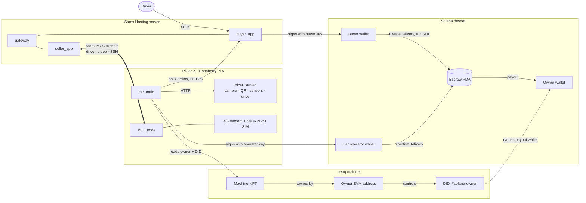

# RoboPay

**A robot car that confirms its own deliveries and gets paid on Solana.**

A buyer locks SOL in an on-chain escrow. The PiCar-X robot car drives to the
delivery box, recognises it by its QR code, looks up its current owner in its
peaq machine identity, and signs the escrow release itself. The owner is paid.
No person approves the payment.

- **Solana** moves the money: an Anchor escrow program on devnet.
- **peaq** says who the car is and who owns it: a Machine-NFT whose DID names
  the owner's Solana payout wallet.
- **Staex** keeps the car reachable: MCC encrypted tunnels and an M2M SIM, so
  the server can talk to a moving car that has no public IP.

## Demo

| | |
|---|---|
| Demo video | *(link added after upload)* |
| Live app | https://robopay.staexhosting.com: `/buyer/` places orders, `/seller/` is the owner dashboard (login in the submission form; the car must be switched on to drive) |
| Escrow program (devnet) | [`3NmsWVX39uvzG3PBNPdSe4FTgudqSeLphJSbMDhV5F8Y`](https://explorer.solana.com/address/3NmsWVX39uvzG3PBNPdSe4FTgudqSeLphJSbMDhV5F8Y?cluster=devnet) |
| Buyer funds escrow (`CreateDelivery`) | [`3hHb4nQu…KtBPUDF`](https://explorer.solana.com/tx/3hHb4nQuJsazUaND7LzSBb4M42qKqvSL3aPf6VjmPAwahk8F1PHWvbTyFTwcqxCZbL42B9TXEAQyFww5fKtBPUDF?cluster=devnet) |
| Car releases payment to owner (`ConfirmDelivery`) | [`3246mXTo…JNQsbCY`](https://explorer.solana.com/tx/3246mXToKGBB9GAwdfZsYPGWRZggLetqXgyGZLecTwKUUPm3DNqVK7xRGGYWS5dp6aj1qpjMjHqxg4dobJNQsbCY?cluster=devnet) |
| Car's peaq Machine-NFT | machine ID `5149596011477982620423871887556457753159696362422273317835964893685329625592` (peaq mainnet) |

In the payout transaction the escrow pays 0.2 SOL to the owner wallet
`BRUeF8xjzM62Q18eSzt2HGiyLErsFnFRi5YaYpsStmpB`. The car's own operator wallet
`7VizNvqBSnHnP8ySnsjxxyUnBQCybVnJHBDRyvaThXia` signs the release and pays only
the network fee.

## The problem

Machines are starting to do paid work: delivery robots, drones, sensors. Today
every one of those payments still needs a person or a platform in the middle to
decide that the work was done and to send the money. RoboPay lets the machine
prove the work and settle the payment itself, while the money still goes to
whoever owns the machine.

## How it works



One delivery, in order:

1. **Order.** The buyer places an order. `buyer_app` signs `CreateDelivery`:
   0.2 SOL moves from the buyer wallet into an escrow PDA, with the owner wallet
   stored as the only allowed recipient.
2. **Pick-up.** `car_main` on the car polls the server's HTTPS endpoint for
   the active order. In the other direction, the server reaches the car through
   Staex MCC tunnels (drive commands, camera stream, SSH).
3. **Arrival.** The car's camera reads the delivery box's QR code
   (`ROBOPAY-BOX-C`); the ultrasonic sensor measures the distance.
4. **Ownership check.** The car reads its Machine-NFT on peaq. The NFT owner
   must also control the DID, and the DID's `#solana-owner` entry gives the
   Solana wallet to pay. If anything doesn't match, the car refuses to pay.
5. **Payment.** The car signs `ConfirmDelivery` with its operator key. The
   program checks the recipient against the one stored in step 1 and pays it.
6. **Cleanup.** The car signs `close_escrow`, which is only allowed after
   delivery, and waits for the next order.

## Solana integration

Program: `anchor/programs/drone-delivery/src/lib.rs`, deployed on devnet as
`3NmsWVX39uvzG3PBNPdSe4FTgudqSeLphJSbMDhV5F8Y`. The same program serves the
earlier drone prototype and the PiCar-X.

| Instruction | Signed by | What it does |
|---|---|---|
| `create_delivery` | buyer | Creates the escrow PDA (seeds `["escrow", operator]`), stores target, deadline, amount and **seller**, and locks the SOL |
| `confirm_delivery` | car operator | Checks the submitted delivery data and that the payee equals the stored seller (`WrongSeller` otherwise), then pays the seller |
| `cancel_delivery` | buyer | Refunds the buyer after the deadline if the delivery is still pending |
| `close_escrow` | car operator | Closes the escrow account; requires status `DELIVERED`, so it can't be used to take the funds |

The Python side uses `solana==0.36.6` / `solders` (`rpi/solana_client.py`).

## Repository layout

| Path | Contents |
|---|---|
| `anchor/` | Solana escrow program (Anchor) |
| `car/` | PiCar-X software (`picar_server.py`, `car_main.py`) and the web apps (`buyer_app.py`, `seller_app.py`, `gateway_app.py`) |
| `car/logging/` | Crash-surviving logs and power monitor for the car |
| `rpi/` | Shared Solana client, config, peaq ownership lookup (`peaq_ownership.py`), payout-wallet tool (`set_payout_wallet.py`); also the earlier drone/letterbox prototype |
| `mobile/CarOwnerApp/` | Android owner app (mirror of [kevkaseeker-source/CarOwnerApp](https://github.com/kevkaseeker-source/CarOwnerApp)) |
| `docs/peaq-integration/` | peaq onboarding and ownership-transfer guides |
| `paper/` | Research paper (Machine Economy Lab) |
| `tests/` | Standalone test scripts |

## Setup and run

You need: Python 3.11+, a Solana devnet wallet with some SOL
([faucet.solana.com](https://faucet.solana.com)), and for the car a SunFounder
PiCar-X on a Raspberry Pi. The escrow program is already deployed; you only
need Anchor if you want to redeploy it.

### 1. Wallets

Create keypair files (64-byte JSON arrays, the Solana CLI format):

```bash
python3 -c "from solders.keypair import Keypair; import json; kp=Keypair(); open('buyer.json','w').write(json.dumps(list(bytes(kp)))); print(kp.pubkey())"
```

You need a **buyer** keypair (server), a **car operator** keypair (car), and
the **owner's public key** (the payout wallet). Fund buyer and operator on devnet.

### 2. Server: buyer app, owner dashboard, gateway

```bash
python3 -m venv venv && . venv/bin/activate
pip install "solana==0.36.6" flask qrcode pillow requests pynacl base58
cd car

export BUYER_KEYPAIR_PATH=/path/to/buyer.json
export SELLER_PUBKEY=<owner Solana pubkey>
export OPERATOR_PUBKEY=<car operator pubkey>
export BUYER_USERNAME=... BUYER_PASSWORD=...      # Basic Auth for /buyer
export SELLER_USERNAME=... SELLER_PASSWORD=...    # Basic Auth for /seller
export MACHINE_TOKEN=...                          # shared secret, same value on the car
export PICAR_SERVER_URL=http://<car host>         # car API, e.g. via MCC tunnel
export PICAR_VIDEO_URL=http://<car video host>

python3 buyer_app.py     # :5001
python3 seller_app.py    # :5002
python3 gateway_app.py   # :8000, serves /buyer/ and /seller/
```

We run these as systemd services on a Staex Hosting VM; the gateway is the one
public address.

### 3. Car (Raspberry Pi with PiCar-X)

Install the SunFounder stack system-wide (`robot-hat`, `vilib`, `picar-x`, see
SunFounder's install docs), then a separate venv for the Solana side:

```bash
python3 -m venv venv
venv/bin/pip install "solana==0.36.6" requests
# optional, for paying the current Machine-NFT owner via peaq:
venv/bin/pip install peaq-os-sdk==0.8.0
```

Run the hardware API with system Python and the delivery logic with the venv:

```bash
sudo python3 car/picar_server.py          # :8080 camera, QR, ultrasonic, drive

WALLET_KEYPAIR_PATH=~/.config/solana/operator.json \
SELLER_PUBKEY=<owner Solana pubkey> \
PC_SERVER_URL=https://<server>/buyer \
MACHINE_TOKEN=<same value as on the server> \
REQUIRE_DISTANCE=false \
venv/bin/python3 car/car_main.py
```

With `MACHINE_ID` (and optionally `PEAQ_RPC_URL`) set, `car_main` ignores the
fixed `SELLER_PUBKEY` and pays the wallet named in the machine's peaq DID.

Connectivity: install Staex MCC on the car and the server (`apt-get install mcc`
from `packages.staex.io`), join both to the same network, and create tunnels
from the car for ports 8080 (API), 9000 (video) and 22 (SSH). Details:
`car/SETUP_AND_ARCHITECTURE.md`.

Optional on the car: `sudo bash car/logging/install.sh` for logs that survive a
crash and a power/temperature monitor.

### 4. Run a delivery

1. Open `/buyer/`, place an order. The page shows the box QR code.
2. Hold the QR code in front of the car's camera for 1–2 seconds.
3. Watch the car's log (`journalctl -u car-trigger -f` if run as a service) and
   the payout transaction on Solana Explorer.

### Key settings

| Variable | Default | Meaning |
|---|---|---|
| `DRONE_PROGRAM_ID` | `3Nms…5F8Y` | Escrow program |
| `SOLANA_RPC_URL` | devnet | Solana RPC |
| `DELIVERY_AMOUNT_SOL` | `0.20` | Escrow amount per order |
| `BOX_QR_CODE` | `ROBOPAY-BOX-C` | QR content the car accepts as "arrived" |
| `REQUIRE_DISTANCE` | `true` | Also require 15–25 cm ultrasonic distance |
| `CAMERA_FPS` | `2.5` | Camera frame rate (keeps the Pi 5 cool) |
| `MACHINE_ID`, `PEAQ_RPC_URL` | unset | Pay the peaq Machine-NFT owner instead of `SELLER_PUBKEY` |
| `MACHINE_TOKEN` | required | Shared secret the car sends to the buyer app's machine endpoints (`/active_order`, `/delivered`, …); the buyer app refuses to start without it |
| `JURY_USERNAME`, `JURY_PASSWORD`, `JURY_EXPIRES` | unset | Optional second, time-limited login for judges; rejected automatically after `JURY_EXPIRES` (YYYY-MM-DD) |

### Tests

Standalone scripts, run with `python3 tests/<file>.py`. The picar_server tests
stub the hardware and run on any Linux machine.

## peaq ownership

The payout wallet is read from the car's peaq DID, not from server config. The
owner sets it with `rpi/set_payout_wallet.py` (asks for the owner's peaq key
without echoing it, refuses unless the key belongs to the NFT owner; Linux or
WSL, since `peaq-os-sdk` doesn't run on Windows):

```bash
python rpi/set_payout_wallet.py <owner Solana pubkey>
```

Handing the car to a new owner is three steps (NFT transfer, claim DID control,
set payout wallet); see `docs/peaq-integration/ownership-transfer-guide.md`.

## Limits of this PoC

- Solana side runs on **devnet**.
- The car's operator key is the trusted signer of "delivery happened"; anyone
  with root on the car could sign a release. A co-signing delivery box is
  proposed in `docs/future-work/box-cosign-proof/`.
- For a new owner to be paid, the buyer app also has to read the owner from the
  DID at order time, because the program fixes the recipient when the escrow is
  created. That, and the ownership handoff inside the CarOwnerApp, are the next
  steps.

## Team

RoboPay is the foundation of the **Machine Economy Lab**, a student research
group at HTW Berlin supervised by Prof. Dr. Alexandra Mikityuk.

- **Kevin Ehrentraut**: founder and technical lead
- **Xinyan Liu**: hardware and mechatronics
- **Yashdeep Singh**: technical research, business and market research

The group studies how AI agents, blockchain payments and secure M2M
connectivity let machines take part in economic transactions without human
intervention: GPS-triggered vs. AI-agent (x402) payments, hardware prototypes,
risks of machine autonomy, and the societal impact.

- Whitepaper 1 (Aug 2025): https://drive.google.com/file/d/1jAlIEzMXRwHfi5iX24QuDZeIgeXCyYw0/view
- Whitepaper 2 (Oct 2025): https://drive.google.com/file/d/1EAghRdOFmiYza4A5TDOuNY5xfbVkrSe-/view
- Indoor PoC demo (drone): https://www.youtube.com/watch?v=bNMbiIRFMoI

## Copyright

© 2025–2026 Kevin Ehrentraut, Xinyan Liu, Yashdeep Singh and contributors. All rights reserved.
The code is public for review (for example by hackathon judges); no license to use, copy or modify it is granted.
For permission, contact the authors.
