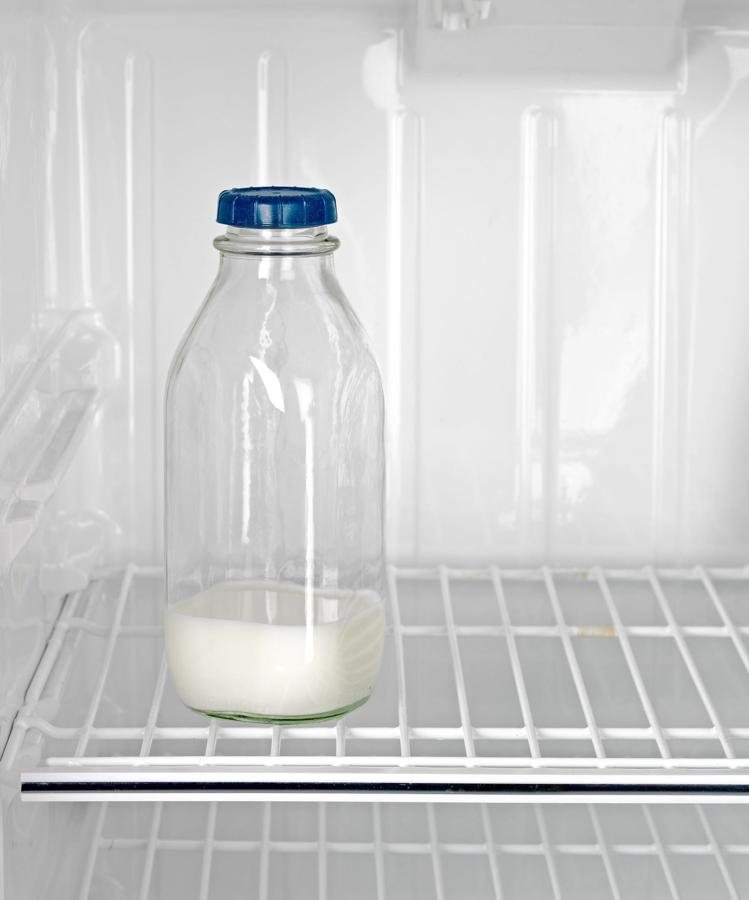
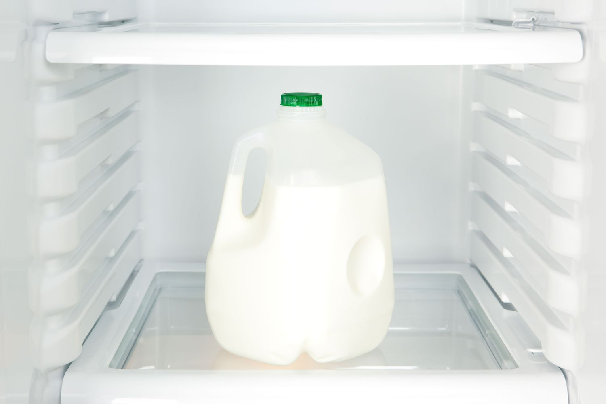

# Kitchen AI Agent — future-work idea

**Status:** v2 implemented (2026-09-27) — see `agent/kitchen_agent.py`. Both halves of the
scenario below are now real: an agent with its own Solana wallet looks at a real camera photo,
asks Claude to judge whether the milk is almost empty, and — only on an explicit "yes" — enforces
a spending cap, funds an escrow, and registers the order with `buyer_app.py` so the existing
delivery robot / confirmation pipeline picks it up unchanged. The camera check fails closed: a
down camera, a model that won't commit to a verdict, or no milk container in frame all mean "don't
order", never a guess. What's still a stand-in: everything else the recipe needs (flour, eggs,
sugar, baking powder) is still a hardcoded pantry entry, not sensed — milk was wired up first
because it's the item in the paper's worked example. See `agent/kitchen_agent.py`'s module
docstring for the exact scope and reasoning.

**Owner:** Kevin originated the idea (2026-09-23); Yashdeep built the v1 order-creation
implementation (2026-09-27). Still open: replacing the hardcoded pantry check with real inventory
sensing, and deciding where this lands in the paper (most likely Chapter 17 Future Work, possibly
also a use-case example earlier in the paper).

## The scenario

A kitchen owner is on the way home and chats with their personal "Kitchen AI Agent": *"I want to
bake a cake."* The agent has sensor visibility into the fridge/kitchen inventory and determines
what's missing for the recipe — say, milk. It then autonomously places and pays for an order,
which is fulfilled by a delivery robot that drops the milk into the owner's letterbox. When the
owner arrives home, they retrieve it from the letterbox — no manual ordering step at any point.

This is architecturally the mirror image of what RoboPay already has built: instead of a human
creating an order through a buyer app (today's flow), an AI agent creates the order autonomously
based on inferred need + inventory state, and the rest of the pipeline (robot delivery, letterbox
drop-off, machine-to-machine payment) is exactly the infrastructure that already exists (Unit C
delivery robot, Unit A smart letterbox, the escrow/x402 payment pattern, and the existing
Claude-tool-use pattern already used in `agent/delivery_agent.py` for autonomous in-the-loop
decisions).

## What's new vs. what's already built

The delivery/payment/letterbox-pickup side already exists. The genuinely new piece is the
*order-creation* side — an agent that:
1. has continuous sensor visibility into a physical space (fridge/kitchen),
2. reasons from a stated goal ("bake a cake") to a concrete shopping need ("missing: milk"), and
3. is trusted to spend money autonomously without per-purchase human confirmation.

Point 3 is the interesting open question: what spending-limit / confirmation model would make
autonomous spending something a real person would actually trust? (E.g. hard per-item price caps,
a daily budget, a "confirm above €X" threshold, or a standing allowlist of approved items/vendors.)

## Setting it up and testing the milk check yourself

This section is a plain-language walkthrough of how to actually try the milk-detection
part on your own computer, written up after doing it for the first time on 2026-09-27.
No robot, no crypto wallet, and no prior setup required for this part — just a photo
and a few minutes.

### What you need

- A computer with Python installed (any recent Mac, Windows, or Linux machine)
- A photo of a milk container (any phone photo works) — try one full and one empty
- An Anthropic API key with a small amount of billing set up (see "Costs" below)

### Costs — what this actually costs you

This is **not** covered by a Claude Pro subscription. Claude Pro (the claude.ai chat
subscription) and the Anthropic **API** (what a program uses to talk to Claude on its
own) are two separate things with separate billing — having Pro does not give free API
usage.

To use the API you buy "usage credits" up front (minimum $5). Each single milk-photo
check costs a small fraction of that — realistically well under one cent per photo,
since each check is just one photo plus a short question and a short answer. In testing
this, a handful of check runs used only a few cents of the $5 starting balance. There is
no ongoing subscription fee — you only pay for what you actually use, and it never
charges more than the credit balance you bought.

### One-time setup

1. **Create an Anthropic Console account** at platform.claude.com (not claude.ai —
   that's the chat app; this is the separate developer console), and add $5 of usage
   credit under Billing. This is a normal account + payment setup, same as any online
   service.
2. **Create an API key** in the Console under "API keys" → "Create key" → "Continue
   with an API key" (skip the "identity federation" option, that's for cloud providers,
   not a plain script). Save the key somewhere safe — it is only shown once.
3. **Download the project** onto the computer you'll test on:
   ```bash
   git clone https://gitlab.com/robopay-group/robopay-research-group.git
   cd robopay-research-group
   ```
4. **Create a clean, separate space for this project's Python packages.** This step
   turned out to matter: on a machine that already has a lot of other Python packages
   installed (for example via Anaconda), installing `anthropic` alongside them can
   create version conflicts in shared networking libraries, causing a confusing crash
   partway through a request. A dedicated space avoids that entirely:
   ```bash
   python3 -m venv venv
   source venv/bin/activate
   pip install requests anthropic
   ```
   Your terminal prompt should now start with `(venv)`. Do this `source` step again
   every time you open a new terminal window to work on this.
5. **Save your API key for this terminal session** (paste your real key, don't retype
   it by hand — a single mistyped character makes it fail):
   ```bash
   export ANTHROPIC_API_KEY=your-real-key-here
   echo $ANTHROPIC_API_KEY
   ```
   The `echo` line should print your key back exactly — check it before continuing.

### Running the test

```bash
python3 agent/kitchen_agent.py --check-milk-only --photo /path/to/your/photo.jpg
```

This does nothing except look at the photo and print a verdict — no wallet, no
blockchain, no order is created. It is the safest possible way to try this.

### What we actually observed (2026-09-27)

Run against this photo of a nearly-empty glass milk bottle:



```
Milk check: ALMOST EMPTY (The glass bottle with a blue cap shows milk filling
only about the bottom fifth of the container, with the rest empty.)
Verdict: ALMOST EMPTY - would order
```

Run against this photo of a full gallon jug:



```
Milk check: looks fine (The gallon jug appears opaque white and full to near
the top, with no visible empty headspace or fill line indicating low content.)
Verdict: looks fine - would not order
```

Both verdicts were correct, and in both cases Claude's stated reasoning matched what was
actually in the photo (container type, fill level, visual cues) rather than a generic
answer — this is the first concrete evidence that the core idea (a model judging real
inventory state from a photo) works, not just the payment plumbing around it.

## Prompt for whoever develops this further

The block below is meant to be handed to an AI assistant (e.g. Yashdeep's own Claude session) as
a starting point for developing this into paper content — background, the scenario, and concrete
open questions to think through.

````text
I'm working on the RoboPay research paper
(gitlab.com/robopay-group/robopay-research-group) and want to develop a
consumer-facing future-work / demonstration scenario for an AI agent that
autonomously triggers real-world delivery: a "Kitchen AI Agent."

## Background (what's already built)

The project has a working autonomous delivery robot ("Unit C") that
verifies arrival and signs a Solana payment with no human in the loop for
the transaction itself, and a separate smart letterbox ("Unit A") that acts
as an independent drop-off point with its own wallet, paid via the same
escrow/x402 pattern. There's also already a Claude-powered "AI delivery
agent" (`agent/delivery_agent.py`) that makes autonomous tool-use decisions
(look at a camera, check distance, confirm delivery) instead of following
a fixed script — the pattern for "an AI agent makes an autonomous
real-world purchasing/triggering decision" already exists in the codebase,
just for the delivery-confirmation side, not the order-creation side.

## The scenario to develop

A kitchen owner is on the way home and chats with their personal "Kitchen
AI Agent": "I want to bake a cake." The agent has sensor visibility into
the fridge/kitchen inventory (camera or smart-shelf sensors) and determines
what's missing for the recipe — say, milk. It then autonomously places and
pays for an order, which is fulfilled by a delivery robot that drops the
milk into the owner's letterbox. When the owner arrives home, they retrieve
it from the letterbox — no manual ordering step at any point.

This is architecturally the mirror image of what's already built: instead
of a human creating an order through a buyer app (today's flow), an AI
agent creates the order autonomously based on inferred need + inventory
state, and the rest of the pipeline (robot delivery, letterbox drop-off,
M2M payment) is exactly the infrastructure that already exists.

## What I want your help thinking through

1. **Where it fits the paper:** this reads as a strong, concrete
   demonstration scenario for Chapter 17 (Future Work — 17.2 AI-Agent and
   17.5 Marketplaces are the closest existing subsections), showing WHY the
   underlying machine-economy infrastructure matters to an actual consumer,
   not just as a technical exercise. Could also work as a motivating
   example earlier in the paper (Chapter 1's use-case framing) if you think
   it's compelling enough.
2. **What's new vs. what's already built:** the delivery/payment/letterbox
   pickup side is already implemented. The genuinely new piece is the
   *order-creation* side — an agent that (a) has continuous sensor
   visibility into a physical space, (b) reasons from a stated goal
   ("bake a cake") to a concrete shopping need ("missing: milk"), and (c)
   is trusted to spend money autonomously without per-purchase human
   confirmation. That third point is the interesting one — what
   spending-limit / confirmation model would make (c) something a real
   person would actually trust? (E.g.: hard per-item price caps, a daily
   budget, a "confirm above €X" threshold, or a standing allowlist of
   approved items/vendors.)
3. **Concrete extensions:** sketch what a minimal proof-of-concept would
   need — doesn't have to be built, just enough to show the pattern is
   real and not just a pitch. E.g.: what would the agent's "sensor → need →
   order" reasoning loop look like using the same Claude tool-use pattern
   `delivery_agent.py` already uses for its camera/distance checks?

Feel free to push back on any part of this framing or take it somewhere
else — the goal is a grounded, technically coherent scenario, not just a
smart-home pitch.
````

## Related idea — can combine for a pitch

A different future-work idea — a letterbox that detects its own sensor failure and autonomously
orders + pays for a repair — was discussed earlier (2026-09-22). It's a technically distinct
scenario (different trigger, different service being bought), but Kevin's read (2026-09-23) is
that the two work well together in a pitch/demo narrative: the same letterbox that just received
the Kitchen Agent's milk delivery is itself a self-maintaining piece of infrastructure — one
story, two "the machine economy handles this without a human" beats back to back. For the paper
itself, they likely still work best as two distinct technical write-ups (different chapter fits,
different owners) that a pitch deck or intro section can narratively connect, rather than one
merged scenario description. Not yet written up on its own; if/when it is, put it in its own
folder (e.g. `docs/future-work/self-maintaining-letterbox/`) and cross-link it from here.
